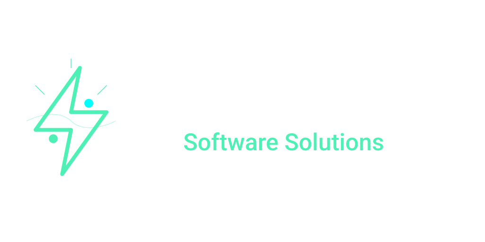

<p align="center">
  
</p>

# 🚀 SnatchVid - Video & Playlist Downloader  

**SnatchVid** is a fast and efficient video and playlist downloader developed by **SNS Automation**.  
This cross-platform app is built with **Tauri, React, and TypeScript**, providing a lightweight yet powerful solution for downloading videos from YouTube and other platforms.

🔗 **Visit Us:** [www.snsautomation.tech](https://www.snsautomation.tech)

---

## 🌟 Features  

- 🎥 **Download Single Videos & Playlists** – Grab videos or entire playlists effortlessly  
- 📽️ **Multiple Formats** – MP4, MP3, WAV, AAC, FLAC  
- 🎚️ **Quality Selection** – Choose from 4K, 1080p, 720p, and more  
- 📂 **Custom Download Folder** – Save files exactly where you want  
- ⏳ **Real-time Progress Tracking** – Monitor your downloads in real-time  
- ⚡ **Lightweight & Fast** – Optimized with **Tauri** for speed and efficiency  

---

## 🛠️ Tech Stack  

- **Frontend:** React + TypeScript + Vite  
- **Backend:** Rust (Tauri)  
- **Download Engine:** yt-dlp for high-speed, reliable downloads  

---

## 🚀 Installation & Setup  

### 1️. Prerequisites  
Ensure you have the following installed:  

- [Node.js (LTS version)](https://nodejs.org/)  
- [Rust & Cargo](https://www.rust-lang.org/)  
- [Tauri CLI](https://tauri.app/)  

### 2️. Clone the Repository  
```sh
git clone https://github.com/sinan2000/snatch-vid.git
```

### 3. Install Dependencies
```sh
cd snatch-vid
npm install
```

### 4. Run in Development Mode
```sh
npm run tauri dev
```

### 5. Build for Production
Ensure to only include needed resources for your target OS build from src-tauri/tauri.conf.json.
```sh
npm run tauri build
```

## 📖 Usage

1. Enter the video or playlist URL
2. Choose format & quality
3. Set the download folder (optional)
4. Click "Download" and track progress

## 🤝 Contributing & Feedback
If you encounter any issues or have feature requests, feel free to contact us via our website: [SNS Automation](https://www.snsautomation.tech)

## 📜 License
MIT License – Feel free to modify and use SnatchVid as needed.

